# 🎮 Simon Memory Game - Production-Ready AWS Deployment

[](https://opensource.org/licenses/MIT)
[](https://www.terraform.io/)
[](https://aws.amazon.com/)

> A sophisticated Simon memory game with enterprise-grade AWS infrastructure, featuring advanced audio capabilities, accessibility compliance, and global CDN deployment.

## 🌟 Project Overview

This project combines a feature-rich Simon memory game with production-ready AWS infrastructure. The game showcases modern web development practices including advanced audio processing, multiple theme systems, and comprehensive accessibility features, while the infrastructure demonstrates enterprise cloud architecture patterns with security, monitoring, and global distribution.

### 🎯 Key Highlights

- **🎵 Advanced Audio System** - 6 sound packs with Web Audio API integration
- **🎨 Dynamic Theme System** - 5 visual themes including accessibility-focused options
- **♿ Accessibility First** - WCAG compliant with screen reader and colorblind support
- **🌍 Global CDN Deployment** - AWS CloudFront with worldwide edge locations
- **🛡️ Enterprise Security** - AWS WAF with rate limiting and attack prevention
- **📊 Real-time Monitoring** - CloudWatch integration with health checks
- **🏗️ Infrastructure as Code** - Complete Terraform automation

---

## 🎮 Game Features

### Core Gameplay
The Simon memory game challenges players to repeat increasingly complex sequences of colored button presses. Each level adds one more step to the sequence, testing memory and concentration skills.

**Game Mechanics:**
- **4 Colored Buttons**: Green (●), Red (▲), Yellow (■), Blue (◆)
- **Progressive Difficulty**: Sequences grow from 1 to unlimited steps
- **Multiple Difficulty Modes**: Easy, Normal, Hard (affects timing)
- **High Score System**: Persistent local leaderboard
- **Keyboard Controls**: Q, W, A, S keys for full accessibility

### 🎵 Advanced Audio System

The game features a sophisticated `AudioManager` class with enterprise-level audio capabilities:

#### **6 Professional Sound Packs**
```javascript
// Sound pack examples
classic: {
    name: 'Classic Tones',
    sounds: [261.63, 329.63, 392.00, 440.00], // Musical notes C4, E4, G4, A4
    waveform: 'sine'
},
retro8bit: {
    name: '8-Bit Retro',
    sounds: [262, 330, 392, 440],
    waveform: 'square' // Authentic chiptune sound
}
```

#### **Web Audio API Features**
- **Custom Oscillators**: Generated tones with ADSR envelope shaping
- **Real-time Visualization**: Canvas-based frequency analysis display
- **Volume Controls**: Separate master and effects volume
- **Tempo Adjustment**: 0.5x to 2x speed multiplier
- **Audio Context Management**: Automatic browser compliance

### 🎨 Dynamic Theme System

**5 Carefully Crafted Themes:**

| Theme | Description | Target Use Case |
|-------|-------------|-----------------|
| **Classic** | Retro dark blue with neon accents | Default gaming experience |
| **Cyberpunk** | Purple/cyan with glitch aesthetics | Futuristic atmosphere |
| **Synthwave** | Pink/orange sunset gradients | 80s nostalgia |
| **High Contrast** | Pure black/white | Accessibility compliance |
| **Colorblind** | Distinct shapes + safe colors | Visual accessibility |

**CSS Custom Properties Implementation:**
```css
:root {
    --primary-bg: #1a1a2e;
    --accent-color: #00ff88;
    --button-green: #4CAF50;
    /* ... theme variables ... */
}

[data-theme="cyberpunk"] {
    --primary-bg: #0a0a15;
    --accent-color: #ff00ff;
    /* ... cyberpunk overrides ... */
}
```

### ♿ Accessibility Features

**WCAG 2.1 AA Compliance:**
- **Screen Reader Support**: Semantic HTML with ARIA labels
- **Keyboard Navigation**: Full game playable without mouse
- **Visual Indicators**: Light-up indicators for hearing-impaired users
- **High Contrast Mode**: Enhanced visibility options
- **Colorblind Support**: Shape indicators (●▲■◆) with safe color palettes
- **Responsive Design**: Works on all screen sizes and orientations

### 🌤️ Weather Integration

**Real-time Weather Display:**
- **Geolocation API**: Attempts to get user's location
- **OpenWeatherMap API**: Live weather data
- **Graceful Fallback**: Mock data if API unavailable
- **Privacy Conscious**: Falls back to London if location denied

---

## 🏗️ AWS Infrastructure Architecture

### Architecture Overview

```mermaid
graph TB
    subgraph "User Layer"
        U[👤 Users Worldwide]
    end
    
    subgraph "AWS Global Infrastructure"
        subgraph "Edge Locations (Global)"
            CF[☁️ CloudFront CDN]
            WAF[🛡️ AWS WAF]
        end
        
        subgraph "US-East-1 (N. Virginia)"
            ACM[🔒 SSL Certificate]
            LOGS[📊 CloudWatch Logs]
        end
        
        subgraph "EU-West-1 (Ireland)"
            S3[🪣 S3 Website Bucket]
            S3L[🪣 S3 Logging Bucket]
            R53[🌐 Route53 DNS]
            CW[📊 CloudWatch Monitoring]
        end
    end
    
    U --> CF
    CF --> WAF
    WAF --> S3
    CF --> S3L
    CF --> ACM
    WAF --> LOGS
    R53 --> CF
    S3 --> CW
    
    classDef user fill:#e1f5fe
    classDef security fill:#ffebee
    classDef storage fill:#f3e5f5
    classDef monitoring fill:#e8f5e8
    
    class U user
    class WAF,ACM security
    class S3,S3L storage
    class LOGS,CW monitoring
```



### 🛡️ Security Architecture

```mermaid
graph LR
    subgraph "Security Layers"
        subgraph "Network Security"
            WAF[🛡️ AWS WAF]
            RL[⏱️ Rate Limiting<br/>2000 req/5min]
            GEO[🌍 Geo Blocking<br/>Optional]
        end
        
        subgraph "Application Security"
            HTTPS[🔒 HTTPS Only<br/>TLS 1.2+]
            CSP[🔐 Content Security Policy]
            HSTS[⚡ HSTS Headers]
        end
        
        subgraph "Data Protection"
            OAC[🔑 Origin Access Control]
            ENC[🔒 S3 Encryption<br/>AES-256]
            PRIV[🚫 Private Buckets]
        end
    end
    
    Internet --> WAF
    WAF --> RL
    RL --> HTTPS
    HTTPS --> CSP
    CSP --> OAC
    OAC --> ENC
    
    classDef security fill:#ffebee
    classDef encryption fill:#e8f5e8
    class WAF,RL,GEO,HTTPS,CSP,HSTS security
    class OAC,ENC,PRIV encryption
```



### 📊 Data Flow Diagram

```mermaid
sequenceDiagram
    participant U as 👤 User
    participant CF as ☁️ CloudFront
    participant WAF as 🛡️ WAF
    participant S3 as 🪣 S3 Bucket
    participant CW as 📊 CloudWatch
    
    U->>CF: 1. Request simon-game.com
    CF->>WAF: 2. Security Check
    WAF->>WAF: 3. Rate Limit & Rules
    WAF->>S3: 4. Forward to Origin
    S3->>CF: 5. Return Files
    CF->>CF: 6. Apply Cache & Headers
    CF->>U: 7. Deliver Content
    
    CF->>CW: 8. Log Metrics
    WAF->>CW: 9. Security Events
    
    Note over U,CW: All requests logged for monitoring
```



### Core Infrastructure Components

#### **🪣 Amazon S3 (Simple Storage Service)**
```terraform
# Main website bucket with security
resource "aws_s3_bucket" "website" {
  bucket = local.bucket_name
  
  # Security: Block all public access
  public_access_block {
    block_public_acls       = true
    block_public_policy     = true
    ignore_public_acls      = true
    restrict_public_buckets = true
  }
  
  # Encryption: AES-256 server-side
  server_side_encryption_configuration {
    rule {
      apply_server_side_encryption_by_default {
        sse_algorithm = "AES256"
      }
    }
  }
}
```

**Features:**
- **Private Buckets**: No direct public access, CloudFront-only
- **Versioning**: File history for rollbacks
- **Lifecycle Policies**: Cost optimization with storage class transitions
- **Server-side Encryption**: AES-256 encryption at rest

#### **☁️ CloudFront Distribution**
```terraform
# Global CDN with edge optimization
resource "aws_cloudfront_distribution" "website" {
  origin {
    domain_name              = aws_s3_bucket.website.bucket_regional_domain_name
    origin_access_control_id = aws_cloudfront_origin_access_control.main.id
  }
  
  default_cache_behavior {
    target_origin_id       = "S3-${aws_s3_bucket.website.bucket}"
    viewer_protocol_policy = "redirect-to-https"
    
    # Security headers
    response_headers_policy_id = aws_cloudfront_response_headers_policy.security_headers.id
  }
}
```

**Features:**
- **Global Edge Locations**: 400+ worldwide locations
- **HTTPS Enforcement**: Automatic HTTP → HTTPS redirects
- **Compression**: Gzip/Brotli for faster loading
- **Custom Error Pages**: SPA-style 404 → index.html routing
- **Security Headers**: HSTS, CSP, X-Frame-Options

#### **🛡️ AWS WAF (Web Application Firewall)**

**Protection Layers:**
1. **Rate Limiting**: 2000 requests per 5 minutes per IP
2. **AWS Managed Rules**: Common attack patterns
3. **SQL Injection Protection**: Custom rules for database attacks
4. **IP Reputation Lists**: Automatic bad actor blocking
5. **Geographic Filtering**: Optional country-level restrictions

```terraform
# Rate limiting rule with health check exception
rule {
  name     = "RateLimitRule"
  priority = 10
  
  action {
    block {}
  }
  
  statement {
    rate_based_statement {
      limit              = var.rate_limit_requests
      aggregate_key_type = "IP"
      
      # Exception for health checks
      scope_down_statement {
        not_statement {
          statement {
            byte_match_statement {
              search_string = "healthcheck"
              field_to_match {
                uri_path {}
              }
            }
          }
        }
      }
    }
  }
}
```

#### **🌐 Route53 DNS Management**
- **Custom Domain Support**: Optional domain configuration
- **Health Checks**: Endpoint monitoring with CloudWatch integration
- **IPv4/IPv6 Support**: A and AAAA record management
- **SSL Certificate**: Automated ACM certificate validation

#### **📊 Monitoring & Logging**
```terraform
# CloudWatch monitoring
resource "aws_cloudwatch_log_group" "waf" {
  name              = "aws-waf-logs-${var.project_name}-${var.environment}"
  retention_in_days = 30
}

# Health checks
resource "aws_route53_health_check" "main" {
  fqdn                    = local.domain_name
  port                    = 443
  type                    = "HTTPS"
  request_interval        = "30"
  failure_threshold       = "3"
}
```

**Monitoring Features:**
- **Real-time Metrics**: Request counts, error rates, latency
- **Security Events**: WAF blocks, rate limit violations
- **Health Monitoring**: Automated uptime checks
- **Log Retention**: 30-day CloudWatch log storage
- **Alerting**: CloudWatch alarms for critical events

---

## 🚀 Setup & Deployment

### Prerequisites

**Required Tools:**
```bash
# AWS CLI v2
aws --version  # Should be 2.x

# Terraform
terraform --version  # Should be 1.0+

# Git
git --version
```

**AWS Permissions Required:**
- S3: Full access for bucket management
- CloudFront: Full access for distribution management  
- WAF: Full access for security rules
- Route53: Full access for DNS (if using custom domain)
- ACM: Certificate management
- CloudWatch: Logging and monitoring

### Quick Start

#### 1️⃣ **Clone Repository**
```bash
git clone <repository-url>
cd simon-memory-game
```

#### 2️⃣ **Configure AWS**
```bash
# Configure AWS credentials
aws configure

# Verify access
aws sts get-caller-identity
```

#### 3️⃣ **Customize Configuration**
```bash
# Copy example configuration
cp terraform/terraform.tfvars.example terraform/terraform.tfvars

# Edit configuration
nano terraform/terraform.tfvars
```

**Sample Configuration:**
```hcl
# Basic settings
aws_region   = "eu-west-1"
environment  = "dev"
project_name = "simon-game"

# Security settings  
enable_waf              = true
enable_logging          = true
rate_limit_requests     = 2000

# Optional: Custom domain
# domain_name = "simon-game.example.com"

# CORS settings
cors_allowed_origins = ["*"]  # Restrict in production
```

#### 4️⃣ **Deploy Infrastructure**
```bash
cd terraform

# Initialize Terraform
terraform init

# Preview deployment
terraform plan

# Deploy infrastructure
terraform apply
```

#### 5️⃣ **Access Your Game**
```bash
# Get CloudFront URL
terraform output cloudfront_domain_name

# Open in browser
open "https://$(terraform output -raw cloudfront_domain_name)"
```

### Environment-Specific Deployments

#### **Development Environment**
```hcl
# terraform/dev.tfvars
environment = "dev"
enable_waf = false           # Optional for dev
enable_logging = false       # Reduce costs
price_class = "PriceClass_100"  # US/EU only
```

#### **Production Environment**  
```hcl
# terraform/prod.tfvars
environment = "prod"
enable_waf = true            # Essential for production
enable_logging = true        # Full monitoring
enable_monitoring = true     # Health checks
price_class = "PriceClass_All"  # Global distribution
rate_limit_requests = 1000   # Stricter limits

# Production domain
domain_name = "simon-game.example.com"
cors_allowed_origins = ["https://simon-game.example.com"]
```

### Custom Domain Setup

#### **1. Domain Configuration**
```hcl
# In terraform.tfvars
domain_name = "simon-game.example.com"
```

#### **2. DNS Setup**
If your domain is **not** managed by Route53:
```bash
# Get CloudFront distribution domain
terraform output cloudfront_domain_name

# Create CNAME record in your DNS provider:
# simon-game.example.com → d1234567890123.cloudfront.net
```

If your domain **is** managed by Route53:
```bash
# Terraform will automatically create DNS records
terraform apply
```

#### **3. SSL Certificate**
Certificates are automatically provisioned via AWS Certificate Manager (ACM):
```terraform
# Automatic certificate with DNS validation
resource "aws_acm_certificate" "main" {
  domain_name       = var.domain_name
  validation_method = "DNS"
  
  lifecycle {
    create_before_destroy = true
  }
}
```

### Deployment Verification

#### **Infrastructure Health Check**
```bash
# Check all resources are created
terraform show | grep "resource\."

# Verify S3 bucket
aws s3 ls s3://$(terraform output -raw s3_bucket_name)

# Check CloudFront distribution
aws cloudfront list-distributions --query 'DistributionList.Items[0].Status'
```

#### **Game Functionality Test**
```bash
# Test website access
curl -I "https://$(terraform output -raw cloudfront_domain_name)"

# Should return:
# HTTP/2 200
# content-type: text/html
# server: CloudFront
```

#### **Security Verification**
```bash
# Test WAF rate limiting (if enabled)
for i in {1..10}; do
  curl -s -o /dev/null -w "%{http_code}\n" "https://$(terraform output -raw cloudfront_domain_name)"
done

# Test HTTPS redirect
curl -I "http://$(terraform output -raw cloudfront_domain_name)"
# Should return 301/302 redirect to HTTPS
```

---

## 🔧 Technical Implementation

### Game Architecture

#### **Modular Class Design**
```javascript
// AudioManager - Handles all audio functionality
class AudioManager {
    constructor() {
        this.audioContext = new AudioContext();
        this.soundPacks = { /* 6 different sound packs */ };
        this.masterVolume = 0.7;
        this.tempo = 1.0;
    }
    
    playSound(buttonIndex, duration) {
        // Web Audio API implementation with ADSR envelope
    }
}

// SimonGame - Main game logic
class SimonGame {
    constructor() {
        this.audioManager = new AudioManager();
        this.sequence = [];
        this.level = 1;
        this.currentTheme = 'classic';
    }
    
    startGame() {
        // Game initialization and sequence generation
    }
}
```

#### **Progressive Web App (PWA) Features**
```json
{
  "name": "Simon Memory Game",
  "short_name": "Simon",
  "description": "Classic memory sequence game",
  "start_url": "/",
  "display": "standalone",
  "background_color": "#1a1a2e",
  "theme_color": "#00ff88",
  "icons": [
    {
      "src": "icon-192.png",
      "sizes": "192x192",
      "type": "image/png"
    }
  ]
}
```

#### **Responsive Design System**
```css
/* Mobile-first responsive breakpoints */
.game-container {
    width: 100%;
    max-width: 600px;
    margin: 0 auto;
}

/* Tablet optimization */
@media (min-width: 768px) {
    .game-board {
        transform: scale(1.2);
    }
}

/* Desktop enhancements */
@media (min-width: 1024px) {
    .game-container {
        max-width: 800px;
    }
}
```

### Infrastructure as Code Best Practices

#### **Modular Terraform Structure**
```
terraform/
├── main.tf              # Provider configuration
├── variables.tf         # Input variables with validation
├── locals.tf           # Computed values and constants
├── s3.tf              # S3 bucket configuration
├── cloudfront.tf      # CloudFront distribution
├── waf.tf             # Security and WAF rules
├── route53.tf         # DNS configuration  
├── acm.tf             # SSL certificate management
├── outputs.tf         # Output values
├── versions.tf        # Provider version constraints
└── terraform.tfvars.example  # Configuration template
```

#### **Security Implementation**
```terraform
# Origin Access Control for secure S3 access
resource "aws_cloudfront_origin_access_control" "main" {
  name                              = "${var.project_name}-${var.environment}-oac"
  description                       = "OAC for Simon Game S3 bucket"
  origin_access_control_origin_type = "s3"
  signing_behavior                  = "always"
  signing_protocol                  = "sigv4"
}

# Comprehensive security headers
resource "aws_cloudfront_response_headers_policy" "security_headers" {
  security_headers_config {
    strict_transport_security {
      access_control_max_age_sec = 31536000  # 1 year
      include_subdomains         = true
      preload                   = true
    }
    
    content_security_policy {
      content_security_policy = "default-src 'self' 'unsafe-inline' data: https:;"
    }
  }
}
```

#### **Cost Optimization Features**
```terraform
# S3 lifecycle policy for cost management
resource "aws_s3_bucket_lifecycle_configuration" "website" {
  rule {
    id     = "cost_optimization"
    status = "Enabled"
    
    transition {
      days          = 30
      storage_class = "STANDARD_IA"
    }
    
    transition {
      days          = 90  
      storage_class = "GLACIER"
    }
  }
}

# Environment-specific configurations
locals {
  cache_ttl = {
    dev     = { min = 0, default = 300, max = 3600 }      # Short cache for dev
    staging = { min = 0, default = 3600, max = 86400 }    # Medium cache 
    prod    = { min = 0, default = 86400, max = 31536000 } # Long cache for prod
  }
}
```

---

## 🔧 Configuration Reference

### Terraform Variables

| Variable | Type | Default | Description |
|----------|------|---------|-------------|
| `aws_region` | string | `"eu-west-1"` | Primary AWS region for resources |
| `environment` | string | `"dev"` | Environment name (dev/staging/prod) |
| `project_name` | string | `"simon-game"` | Project identifier for resource naming |
| `domain_name` | string | `""` | Optional custom domain name |
| `enable_waf` | bool | `true` | Enable AWS WAF protection |
| `enable_logging` | bool | `true` | Enable CloudFront access logging |
| `enable_monitoring` | bool | `false` | Enable Route53 health checks |
| `rate_limit_requests` | number | `2000` | WAF rate limit per 5 minutes |
| `price_class` | string | `"PriceClass_100"` | CloudFront price class |
| `cors_allowed_origins` | list(string) | `["*"]` | CORS allowed origins |

### Game Configuration

The game supports various customization options through localStorage:

```javascript
// Audio settings
{
  "currentPack": "classic",        // Sound pack selection
  "masterVolume": 0.7,            // Main volume (0.0-1.0)  
  "effectsVolume": 0.8,           // Effects volume (0.0-1.0)
  "tempo": 1.0,                   // Speed multiplier (0.5-2.0)
  "visualizationEnabled": true,    // Audio visualization
  "visualIndicatorsEnabled": true  // Accessibility indicators
}

// Theme settings  
{
  "simonTheme": "classic"         // Current theme selection
}

// Game progress
{
  "simonHighScore": 15            // Personal best score
}
```

---

## 📊 Monitoring & Maintenance

### CloudWatch Metrics

**Automatic Metrics Collection:**
- **Request Count**: Total requests per time period
- **Error Rate**: 4xx and 5xx response percentages  
- **Cache Hit Ratio**: CloudFront cache effectiveness
- **Origin Response Time**: S3 response latency
- **WAF Blocked Requests**: Security event tracking

### Health Checks

```terraform
# Route53 health monitoring
resource "aws_route53_health_check" "main" {
  fqdn                    = local.domain_name
  port                    = 443
  type                    = "HTTPS"
  request_interval        = "30"        # Check every 30 seconds
  failure_threshold       = "3"         # 3 failures = unhealthy
  
  tags = {
    Name = "${var.project_name}-${var.environment}-health-check"
  }
}

# CloudWatch alarm for health check failures
resource "aws_cloudwatch_metric_alarm" "health_check" {
  alarm_name          = "${var.project_name}-${var.environment}-endpoint-down"
  comparison_operator = "LessThanThreshold"
  evaluation_periods  = "2"
  metric_name         = "HealthCheckStatus"
  namespace           = "AWS/Route53"
  period              = "60"
  statistic           = "Minimum"
  threshold           = "1"
  alarm_description   = "This metric monitors endpoint health"
}
```

### Maintenance Tasks

#### **Regular Updates**
```bash
# Update Terraform providers
terraform init -upgrade

# Check for security updates
terraform plan

# Apply updates
terraform apply
```

#### **Certificate Renewal**
```bash
# ACM certificates auto-renew, but verify status
aws acm list-certificates --region us-east-1

# Check certificate expiration
aws acm describe-certificate --certificate-arn <cert-arn> --region us-east-1
```

#### **Performance Monitoring**
```bash
# CloudFront cache statistics
aws cloudfront get-distribution-config --id <distribution-id>

# WAF request statistics  
aws wafv2 get-web-acl --scope CLOUDFRONT --id <web-acl-id> --region us-east-1
```

---

## 🤝 Contributing

### Development Setup

#### **Local Development**
```bash
# Serve locally for development
python3 -m http.server 8000

# Or with Node.js
npx serve .

# Access at http://localhost:8000
```

#### **Code Style Guidelines**
- **JavaScript**: ES6+ features, modular class design
- **CSS**: BEM methodology, custom properties for theming
- **Terraform**: Consistent formatting with `terraform fmt`
- **Documentation**: Clear comments and JSDoc annotations

#### **Testing**
```bash
# Terraform validation
terraform validate

# Security scanning
tfsec terraform/

# Format checking  
terraform fmt -check
```

### Contribution Workflow

1. **Fork the Repository**
2. **Create Feature Branch**: `git checkout -b feature/new-feature`
3. **Make Changes**: Follow code style guidelines
4. **Test Locally**: Verify functionality works
5. **Submit Pull Request**: Include description of changes

---

## 📄 License

This project is licensed under the MIT License - see the [LICENSE](LICENSE) file for details.

---

## 🙏 Acknowledgments

- **Web Audio API Documentation** - Mozilla Developer Network
- **AWS Architecture Guidelines** - AWS Well-Architected Framework  
- **Accessibility Guidelines** - W3C Web Content Accessibility Guidelines (WCAG)
- **Terraform Best Practices** - HashiCorp Documentation
- **Simon Game Inspiration** - Classic Milton Bradley electronic game (1978)

---

## 📞 Support

- **Issues**: [GitHub Issues](../../issues)
- **Documentation**: This README and inline code comments
- **AWS Support**: [AWS Support Center](https://console.aws.amazon.com/support/)
- **Terraform**: [HashiCorp Documentation](https://www.terraform.io/docs)

---

**Built with ❤️ using modern web technologies and enterprise cloud architecture**